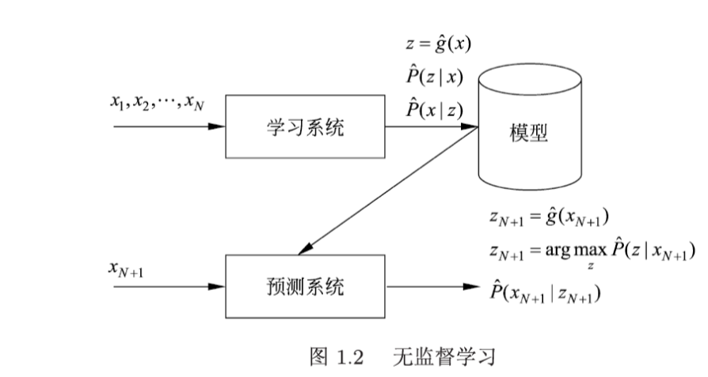

[参考](https://datawhalechina.github.io/statistical-learning-method-solutions-manual/#/)
# 统计学习的分类
## 基本分类  
### 监督学习  
#### 输入空间、特征空间、输出空间 
#### 联合概率分布  
监督学习假设输入与输出的随机变量$X$和$Y$遵循联合概率分布$P(X,Y)$。训练数据和测试数据被看作是$P(X,Y)$独立同分布产生的。这是监督学习关于数据的**基本假设**。
#### 假设空间
模型是由输入空间到输出空间的映射的集合，该集合被称为**假设空间（hypothiesis space）**。监督学习的模型可以分为概率模型和非概率模型，可分别表示为$P(Y|X)$和$Y=f(X)$，当给定具体的输入时$x$和$y$为小写。
#### 形式化

### 无监督学习  
$X$是输入空间，$Z$是隐式结构空间。要学习的模型可以表示为函数$z=g(x)$，条件概率分布$P(z|x)$，或者条件概率分布$P(x|z)$的格式，其中$x\in X$是输入，$z\in Z$是输出。同监督学习的假设空间概念，将所有可能的模型集合称为假设空间。  
在学习过程中，学习系统从训练数据集学习，得到一个最优模型，表示为函数$z=\hat g(x)$，条件概率分布$\hat P(z|x)$或者条件概率分布$\hat P(x|z)$。在预测过程中，对于系统给定给的输入$x_{N+1}$，由模型$z_{N+1}=\hat g(x_{N+1})$，或者$z_{N+1}=\arg\max \hat P(z|x_{N+1})$给出相应的输出$z_{N+1}$进行聚类或者降维，或者由模型$\hat P(x|z)$给出输入的概率$\hat P(x_{N+1}|z_{N+1})$，进行概率估计。

### 强化学习
  
假设智能系统与环境的互动基于**马尔可夫决策过程**，智能系统能观测到的是与环境互动得到的数据序列。强化学习的本质是学习最优的序贯决策。  
强化学习的马尔可夫决策过程是状态、奖励、动作序列上的随机过程，由五元组$<S,A,P,r,\gamma>$组成。
- $S$有限状态集合
- $A$有限动作集合
- $P$是状态转移概率函数：$P(s'|s,a)=P(s_{t+1}=s'|s_t=s,a_t=a)$
- $r$是奖励函数：$r(s,a)=E(r_{t+1}|s_t=s,a_t=a)$
- $\gamma$是衰减系数$\gamma \in [0,1]$   

 策略$\pi$定义为给定状态下动作的函数$a=f(s)$或者条件概率分布$P(a|s)$。给定一个策略$\pi$，智能系统与环境互动的行为就已经确定。  
 价值函数或状态价值函数定位为策略$\pi$从某一状态$s$开始的长期累积奖励的数学期望：
 $$v_{\pi}(s)=E_{\pi}[r_{t+1}+\gamma r_{t+2}+\gamma^2 r_{t+3}+ \dots|s_t=s]$$  
 动作价值函数定义为策略$\pi$的从某一状态$s$和动作$a$开始的长期累积奖励的数学期望：
 $$q_{\pi}(s,a)=E_{\pi}[r_{t+1}+\gamma r_{t+2}+\gamma^2 r_{t+3}+ \dots|s_t=s,a_t=a]$$  
 强化学习的目标就是在所有可能的策略中选出价值函数最大的策略$\pi^*$，而在实际学习中往往从具体的策略出发，不断优化已有的策略。这里的$\gamma$表示未来的奖励会有所衰减。  
 强化学习方法中有基于策略的(policy-based)、基于价值的(value-based)，这两种属于无模型的（model-free）方法，还有有模型的（model-based）方法。  
 - 有模型的方法试图直接学习马尔可夫决策过程的模型，包括转移概率函数$P(s'|s,a)$和奖励函数$r(s,a)$。这样可以通过模型对环境的反馈进行预测，求出价值函数最大的策略$\pi^*$。  
 - 无模型的、基于策略的方法不直接学习模型，而是试图求解最优策略$\pi^*$，表示为函数$a=f^*(s)$或者是条件概率分布$P^*(a|s)$
 - 无模型的，基于价值的方法不直接学习模型，而是试图求解最优价值函数，特别是最优动作价值函数$q^*(s,a)$。这样可以间接地学到最优策略，根据该策略在给定地状态下做相应地动作。学习从一个具体的价值函数开始，通过搜索更优的价值函数进行。

### 半监督学习和主动学习
主动学习即模型提出期望标注的数据给教师，提高训练的效率。
## 按模型分类
### 概率模型和非概率模型
**如何理解在监督学习中，概率模型是生成模型，非概率模型是判别模型？**
> 概率模型取条件概率分布形式$P(z|x)$或$P(x|z)$，非概率模型取函数形式$z=g(x)$。

TODO

### 线性模型和非线性模型
$z=g(x)$根据其中$g$为线性或非线性分类。
### 参数化模型和非参数化模型
参数化模型假设模型的参数维度固定，模型可以由有限维参数完全刻画。非参数化模型假设模型参数的维度不固定或者说无穷大，随训练量的增加而不断增大。
## 按算法分类
- 在线学习：每次接收一个样本进行预测，之后不断重复该操作。
- 批量学习：一次接收所有数据学习模型，之后预测。
  
## 按技巧分类
### 贝叶斯学习
假设随机变量$D$表示数据，随机变量$\theta$表示模型参数。根据贝叶斯定理可以求得后验概率$P(\theta|D)$：
$$P(\theta|D)=\frac{P(\theta)P(D|\theta)}{P(D)}$$  
其中$P(\theta)$是先验概率，$P(D|\theta)$是似然函数。所谓似然，是指已知某些观测所得到的结果时，对有关事物之性质的参数进行估计。  
预测时，计算数据对后验概率分布的期望值：
$$P(x|D)=\int P(x|\theta,D)P(\theta|D)d\theta$$
这里的$x$是新样本。    

**贝叶斯估计和极大似然估计**
> 假设先验分布是均匀分布，后验概率取最大，就能从贝叶斯估计得到极大似然估计。

### 核方法
核方法通过使用核函数表示核学习非线性模型的一种机器学习方法。将线性模型扩展导非线性模型，直接的做法是显示地定义从输入空间（低维空间）到特征空间（高维空间）地映射，在特征空间中进行内积运算。核方法地技巧在于不显式地定义这个映射而是直接定义核函数，即映射之后再特征空间地内积，这样可以简化计算，达到相同的效果。
>假设$x_1$和$x_2$是输入空间的任意两个实例（向量），其内积是$<x_1,x_2>$。假设从输入空间到特征空间的映射是$\phi$，其在特征空间中的内积为$<\phi(x_1),\phi(x_2)>$核函数满足$K(x_1,x_2)=<\phi(x_1),\phi(x_2)>$。

# 统计学习方法三要素
$$方法=模型+策略+算法$$
## 模型
$$\mathcal{F}=\{f|Y=f(X)\}$$
其中$X$和$Y$是定义在输入空间$\mathcal{X}$和输出空间$\mathcal{Y}$上的变量。这时$\mathcal{F}$通常是一个由参数向量决定的函数族：
$$\mathcal{F}=\{f|Y=f_{\theta}(X),\theta \in \mathbb{R}^n\}$$
参数向量$\theta$取值于$n$维欧式空间$\mathbb{R}$，称为参数空间。  

假设空间也可以定义为条件概率的集合:
$$\mathcal{F}=\{P|P(Y|X)\}$$
这时$\mathcal{F}$通常是由参数向量决定的条件概率分布族：
$$\mathcal{F}=\{P|P_{\theta}(Y|X),\theta \in \mathbb{R}^n\}$$

## 策略
在策略这里引入损失函数和风险函数的概念。  

损失函数的期望：
 $$R_{exp}(f)=E_P[L(Y,f(X))]
 =\int_{\mathcal{X}\times \mathcal{Y}}L(y,f(x))P(x,y)dxdy$$

 这是理论上模型$f(X)$关于联合分布$P(X,Y)$的平均意义下的损失，称为风险函数或期望损失。由于我们无法知道联合分布$P(X,Y)$，因此我们需要引入经验风险的概念。  
 引入一个训练数据集
 $$T=\{(x_1,y_1),(x_2,y_2),\dots ,(x_N,y_N)\}$$
 模型$f(X)$关于训练数据集的平均损失称为经验风险或经验损失记作$R_{emp}$：
 $$R_{emp}(f)=\frac{1}{N}\sum_{i=1}^{N}L(y_i,f(x_i))$$
 当样本容量$N$趋于无穷的时候，$R_{emp}(f)$趋向于$R_{exp}(f)$。但在实际过程中训练的样本数目有限，需要对经验风险进行矫正，这里引入结构风险的概念。结构风险最小化等价于正则化，结构风险在经验风险上加上表示模型复杂度的正则化项。在假设空间、损失函数以及训练数据集确定的情况下，结构风险的定义是：
 $$R_{srm}(f)=\frac{1}{N}\sum_{i=1}^{N}L(y_i,f(x_i))+\lambda J(f)$$
 求解最优模型就是求解最优化问题：
 $$\underset{f\in \mathcal{F}}{min}\frac{1}{N}\sum_{i=1}^{N}L(y_i,f(x_i))+\lambda J(f)$$

 ## 算法
 算法是指学习模型的具体计算方法，例如神经网络中的梯度下降法。

 # 模型评估和模型选择
 ## 训练误差与测试误差
 ## 过拟合和模型选择

 # 正则化与交叉验证
 ## 正则化
 正则化的一般形式
   $$\underset{f\in \mathcal{F}}{min}\frac{1}{N}\sum_{i=1}^{N}L(y_i,f(x_i))+\lambda J(f)$$
   若正则化项时参数向量$L_2$范数：
   $$L(w)=\frac{1}{N}\sum_{i=1}^{N}(f(x_i;w)-y_i)^2+\frac{\lambda}{2}\left \| w\right \|^2 $$
   其中$\left \| w\right \|$表示参数向量$w$的$L_2$范数。  
$L_1$范数的形式为：
$$L(w)=\frac{1}{N}\sum_{i=1}^{N}(f(x_i;w)-y_i)^2+\lambda\left \| w\right \|_1 $$

在性能一致的情况下选择更简单的模型。

## 交叉验证
- 简单交叉验证
- S折扣交叉验证
- 留一交叉验证

# 泛化能力

## 泛化误差
现实中通过测试误差来评价学习方法的泛化能力。但由于测试集有限，这种方法不可靠。从理论上来说可以表达为模型$\hat f$对所有未知数据预测的误差的期望风险：
$$R_{exp}(\hat f)=E_P[L(Y,\hat f( X))]=\int_{\mathcal{X}\times\mathcal{Y}}L(y,\hat f(x))P(x,y)dxdy$$

## 泛化误差上界
学习方法的泛化能力分析往往是通过研究泛化误差的概率上界进行的，简称为泛化误差上界。具体来说，就是通过比较两种学习方法的泛化误差上界的大小来比较他们的优劣。泛化误差上界通常具有如下性质：他是样本容量的函数，样本容量增加，泛化上界趋向于0；它是假设空间容量的函数，假设空间容量越大，模型越难学，泛化误差上界越大。  
对于二类分类问题，当假设空间是有限个函数的集合$\mathcal{F}=\{f_1,f_2,\dots,f_d\}$时，对任意一个函数$f\in\mathcal{F}$，至少以概率$1-\delta$，$0<\delta<1$，以下不等式成立：
$$R(f)\le \hat R(f)+\epsilon(d,N,\delta)$$
其中，
$$\epsilon(d,N,\delta)=\sqrt{\frac{1}{2N}(\log d+\log \frac{1}{\delta})} $$

# 生成模型和判别模型 
- 生成模型：学习联合概率分布$P(X,Y)$,典型的有朴素贝叶斯法和隐马尔可夫模型。
- 判别模型：直接学习决策函数$f(X)$或者条件概率分布$P(Y|X)$作为预测的模型，即判别模型。

