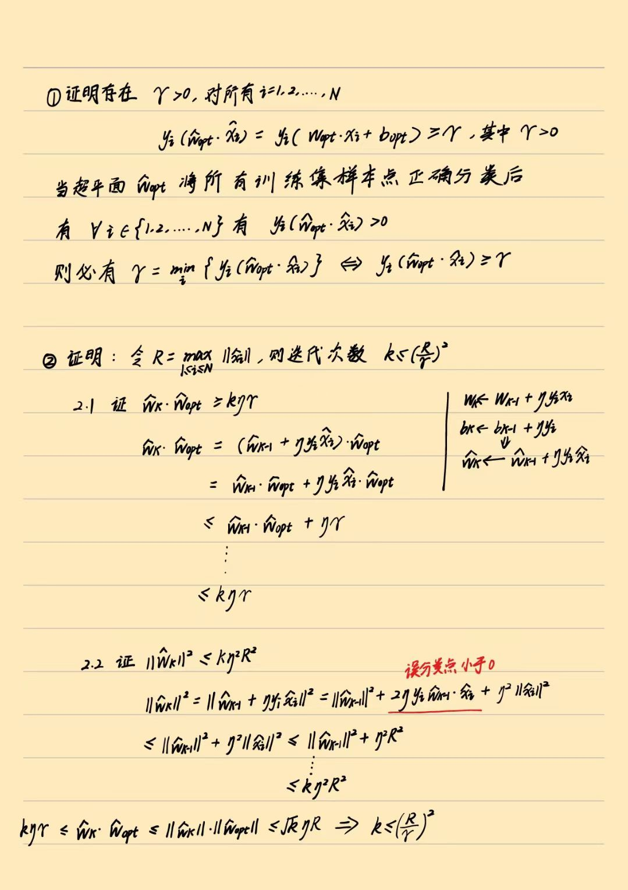

# 感知机
**为什么误分类点到超平面的距离之和为$-\frac{1}{||w||}\sum_{x_i\in M}y_i(w\cdot x_i +b)$，而优化的损失函数为$-\sum_{x_i\in M}y_i(w\cdot x_i +b)$?**  

>正确分类并不依赖于$\frac{1}{||w||}$系数，简化后的目标$-\sum_{x_i\in M}y_i(w\cdot x_i +b)$ 仍能反应超平面对误分类点的惩罚程度，是一个有效的优化目标。

## 证明感知机算法的收敛性  
设训练数据集$T=\{(x_1,y_1),(x_2,y_2),\dots,(x_N,y_N)\}$是线性可分的，其中$x_i\in \mathcal{X}=\mathbb{R}^n,y_i\in \mathcal{Y}=\{-1,+1\},i=1,2,\dots,N$，则 

$(1)$ 存在满足条件$\left \|\hat{w}_{opt} \right \|=1$的超平面$\hat w_{opt} \cdot \hat x=w_{opt}\cdot x+b_{opt}=0$将训练数据集完全分开；且存在$\gamma>0$，对于所有$i=1,2,\dots,N$ 有
$$
y_i(\hat w_{opt}\cdot \hat x_i)=y_i(w_opt\cdot x_i+b_{opt})\ge\gamma
$$  
$(2)$令$R=\underset{1\le i\le N}{\max}\left \|\hat x_i\right \|$，则感知机算法在训练数据集上误分类的次数$k$满足不等式
$$
k\le (\frac{R}{\gamma})^2
$$

## 感知机对偶形式的意义 
### 感知机的原始形式  
$$
f(x)=sign(w\cdot x+b)
$$
### 感知机的对偶形式
$$
w=\sum_{i=1}^{N}n_i\eta y_ix_i \\
b=\sum_{i=1}^{N}n_i\eta y_i  \\
f(x)=sign(\sum_{j=1}^{N}n_j \eta y_jx_j\cdot x+\sum_{j=1}^{N}n_j\eta y_j)
$$  
更新参数的形式为:
$$
n_j \gets n_j + 1
$$
其中$j$表示当前模型分类出错的点。与原始形式相比，我们可以创建一个$N\times N$的$Gram$矩阵来存储所有点之间的内积。
$$
G=[x_i\cdot x_j]_{N\times N}
$$
每次计算$\sum_{j=1}^{N}n_j \eta y_jx_j\cdot x$部分仅需查表求和即可，省去内积计算操作。
