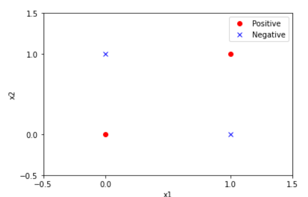

# 习题
## 2.1 验证感知机不能表达异或

观察易得，无法使用一条直线使两类点分开，故该数据集线性不可分。

## 2.2
Exercise.ipynb

## 2.3 证明：样本集线性可分的充分必要条件是正实例点集所构成的凸壳与负点集所构成的凸壳互不相交。

1. 凸壳和线性可分的定义  
设集合$S\subset R^n$，是由$R^n$中的$k$个点所组成的集合，即$S=\{x_1,x_2,\dots,x_k\}$。定义凸壳$conv(S)$为：
$$
conv(S)=\{x=\sum_{i=1}^{k}\lambda_ix_i|\sum_{i=1}^{k}\lambda_i=1,\lambda_i\ge 0,i=1,2,\dots,k\}
$$
2. 证明必要性：线性可分$\to$凸壳不相交
   
3. 证明充分性：凸壳不相交$\to$线性可分

